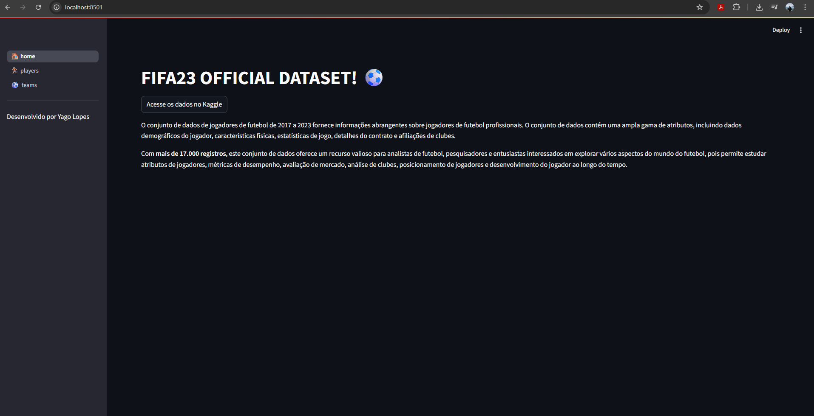
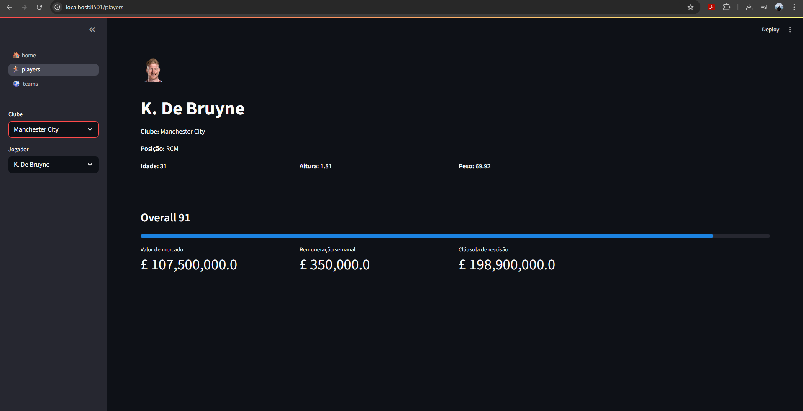
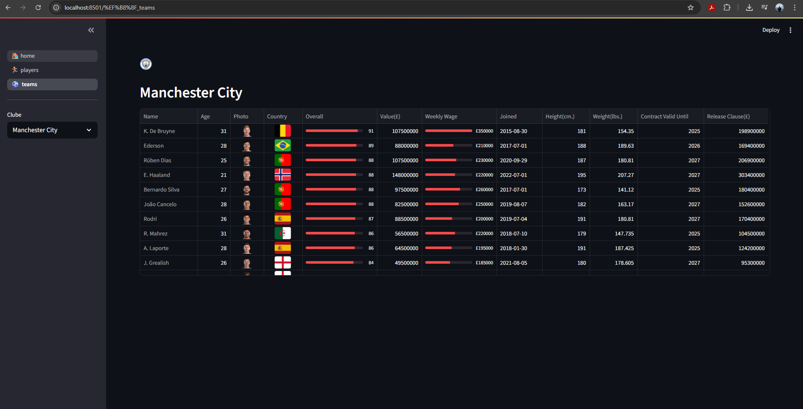

# FIFA23 Official Dataset App ⚽

Este é um aplicativo web interativo desenvolvido com [Streamlit](https://streamlit.io/) que permite explorar e analisar dados oficiais de jogadores de futebol do FIFA 23. O projeto utiliza um dataset completo, limpo e atualizado, contendo informações detalhadas sobre mais de 17.000 jogadores, incluindo atributos, estatísticas, contratos, valores de mercado e muito mais.


## Demonstração






## Funcionalidades

- Visualização de detalhes dos jogadores por clube e por nome.
- Exibição de estatísticas individuais e fotos dos jogadores.
- Consulta rápida de valor de mercado, salário semanal, cláusula de rescisão, idade, altura, peso e muito mais.
- Tabela de jogadores do clube com imagens, bandeiras, estatísticas e progress bars.
- Acesso direto ao dataset original no Kaggle.
- Interface amigável e responsiva.

## Instalação

1. **Clone o repositório:**
   ```bash
   git clone https://github.com/SEU_USUARIO/SEU_REPOSITORIO.git
   cd SEU_REPOSITORIO
   ```

2. **(Opcional) Crie e ative um ambiente virtual:**
   ```bash
   python -m venv venv
   # Linux/Mac:
   source venv/bin/activate
   # Windows:
   venv\Scripts\activate
   ```

3. **Instale as dependências:**
   ```bash
   pip install -r requirements.txt
   ```


4. **Baixe o dataset:**
   - Baixe o arquivo `CLEAN_FIFA23_official_data.csv` em [Kaggle - FIFA 23 Official Dataset](https://www.kaggle.com/datasets/kevwesophia/fifa23-official-datasetclean-data).
   - Coloque o arquivo na pasta `datasets/` do projeto.

## Como executar

Execute o app principal com o comando:
```bash
streamlit run home.py
(pode ser necessário rodar como 1_🏠_home.py)
```

Acesse o link gerado, normalmente http://localhost:8501, em seu navegador.

## Estrutura do Projeto

```
.
├── datasets/
│   └── CLEAN_FIFA23_official_data.csv
├── home.py
├── players.py
├── teams.py
├── requirements.txt
└── README.md
```


## Créditos e Dados

- **Dataset Original:** [Kaggle - FIFA23 Official Dataset (Clean Data)](https://www.kaggle.com/datasets/kevwesophia/fifa23-official-datasetclean-data)
- **Desenvolvido por:** Yago Lopes


---

Se quiser incluir prints de tela, GIFs de demonstração ou adicionar mais detalhes, basta me informar ou inserir no local indicado. Se precisar de um exemplo de `requirements.txt` ou tiver dúvidas sobre publicação, só avisar!